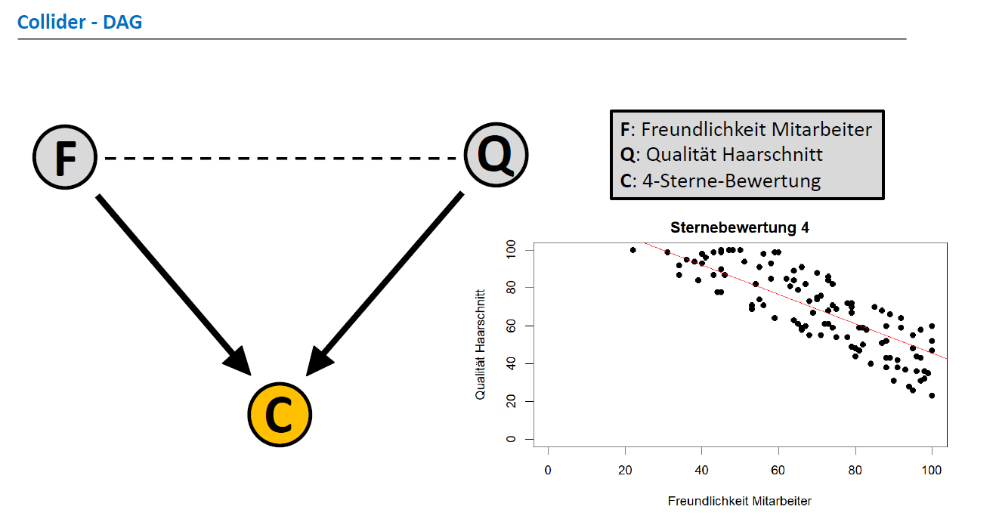

# Collider Bias: The Hairdesser Example 

### Abstract

In our data product, we contribute to the Digital Causality Lab project by 
analyzing the collider bias, which is also referred to as the selection bias in 
some cases. The collider bias is one possible source of a bias under the 
null hypothesis, which can skew the results of a causal case study, 
permitting the flow of association when there is no underlying causal 
relationship between a set of variables. 

To this end, we simulate a data set in the statistical software R, containing 
500 barbershops as our observed units. Every unit has a friendliness-
score and a quality-score, referring to the employees and the received 
haircuts, respectively, which are independently and identically distributed. 
Also, every barbershop gets a rating ranging from one to five stars, which 
is affected by the combination of the other two variables.

We illustrate the collider bias and its effects by showing the results when 
conditioning for the collider, i.e., only focusing on four-star barbershops 
for example, and comparing these to the results in the case where we do 
not condition for any star rating. 

### Current State and Call for Extension

Currently, we generated the data and illustrate the example in a MS PowerPoint presentation.
In a next step, the case study could be extended by

* Including the example in a Quarto notebook or presentation
* Setting up a shiny app in R or Python such that users can interactively play around with sample selection according to ratings
* Collect and analyze real data, e.g., on google recommendations

